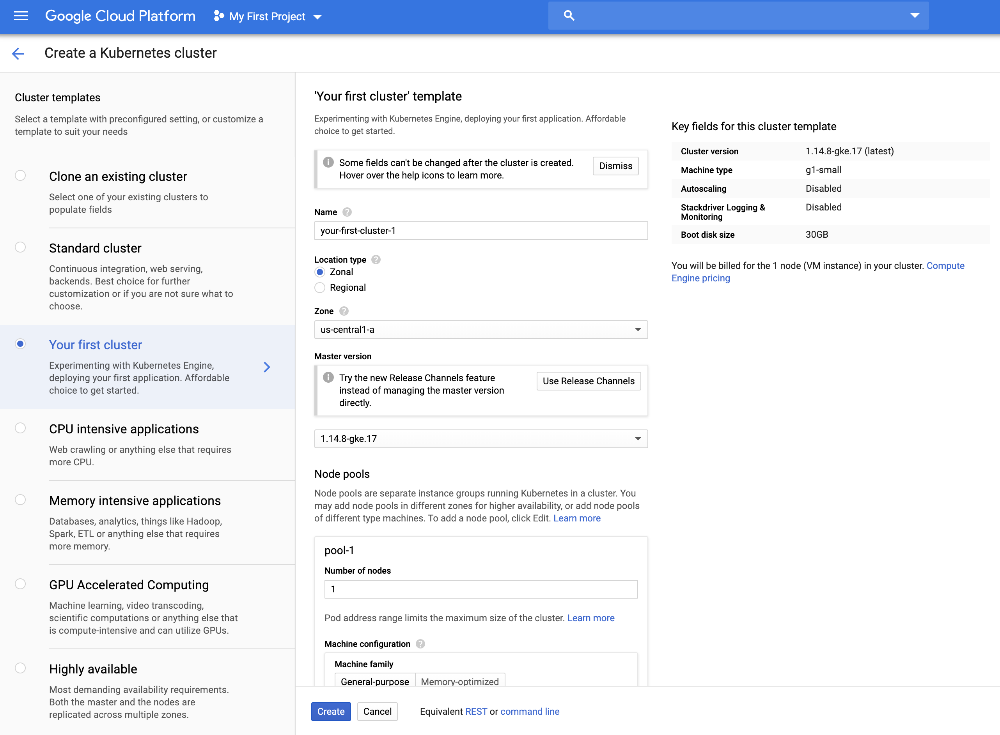

```{r setup, include=FALSE}
knitr::opts_chunk$set(echo = TRUE, eval = FALSE)
```

## How to deploy your shiny app to Kubernetes

This guide assumes you have a Shiny app written in R. I have an example one called `wine-explorer` here for reference.

### Dockerize Shiny app

Getting a Shiny app to run in a Docker container is really easy thanks to the [`rocker`](https://www.rocker-project.org/images/) project, specifically the `shiny` image. That image comes with R, Shiny Server, shiny, rmarkdown, as well the system libraries for rendering graphics.

The first step is to make your own docker image starting with `rocker/shiny` image. To do this, create a `Dockerfile` and add the first line `FROM rocker/shiny`. That's all you need to do to leverage all the work from the rocker team! This is because docker images are stackable, which means you can build them in layers.

The next piece is to add all the custom options you want. I'm just going to list what I did which are step-by-step instructions for docker:

Remove all the example apps that come with Shiny Server

```
RUN rm -rf /srv/shiny-server/*
```

Update the underlying Linux OS (based on Debian) and install system level packages

```
RUN apt-get update && apt-get install -y \
    libssl-dev \
    libxml2-dev
```

Install the R packages I want to use

```
RUN install2.r --error \
    ggplot2 \
    data.table
```

Copy the code for my Shiny app locally to the container's Shiny Server directory

```
COPY wine-explorer /srv/shiny-server
```

Add an entry point for what to run when the container starts by default -- start Shiny Server

```
CMD ["/usr/bin/shiny-server.sh"]
```

These instructions are pretty similar to what you might enter in the command line when you are installing a Shiny app to Shiny Server directly on a Linux sever, with the noticable difference that they all start with docker specific keywords:

- `FROM`
- `RUN`
- `COPY`
- `CMD`

There are a lot of other docker keywords and options you might want to [explore here](https://docs.docker.com/engine/reference/builder/).

With the `Dockerfile` created, you next need to build it. When you do this, you need to name the image you are building. I named my docker image `shiny-k8s`.

```{bash}
docker build -t shiny-k8s --file Dockerfile
```

The `--file Dockerfile` is explicit, but you docker knows to look for a file with that name so you could replace that part with just `.`

Now you can run the built docker image to make sure your app works

```{bash}
docker run --rm -p 3838:3838 shiny-k8s
```

This starts up a virtual machine runing the Linux version your docker image is based on (Rocker uses Debian) and all the other instructions you gave it in the docker image you started `FROM` plus what you put in your `Dockerfile`. The additional options here `--rm` tells docker to remove the container when you stop running it, and `-p 3838:3838` forwards port 3838 on the container to your local machine so that you can open `localhost:3838` in your browser and check that the Shiny app worked like you expected.

### Getting to Kubernetes

First off, let's establish some acronymns:

- `k8s`: Kubernetes
- `GCP`: Google Cloud Platform
- `GCR`: Google Container Registry
- `CLI`: Command Line Interface

With that out of the way, there are multiple ways you can get started depending on your preference for a visual interface or a CLI.

#### Step 1: Create a cluster

If you don't have a cluster ready, you'll need to create one. GCP provides a service just for running k8s clusters making this process super easy. 

Once you setup a GCP account and create a project, you'll want to [install the `gcloud` CLI](https://cloud.google.com/sdk/gcloud/) and add your project ID as an environment variable (for copy/pasta goodness)

```
export PROJECT_ID=random-words-123456
```

There are a lot of options for your cluster, most of which come with good defaults, such as:

- `region`
- `machine-type`
- `num-nodes`
- `max-pods-per-node`
- `enable-autoscaling`

Creating the cluster using the CLI


```{bash}
gcloud container clusters create shiny-cluster --zone us-central1-a  # append any other options
```

or using the GCP web console




#### Step 2: Push Docker Image to a Cloud Registry

Once you have a cluster to deploy to, you'll need to get your local docker image up to GCR so your k8s cluster can pull from it. You could also use a public registry like Docker Hub if you wanted.

```{bash}
docker tag shiny-k8s us.gcr.io/$PROJECT_ID/shiny-k8s:0.1
```

```{bash}
docker push us.gcr.io/$PROJECT_ID/shiny-k8s:0.1
```

You should now be able to see your image lissted in GCR

using the CLI

```{bash}
gcloud container images list-tags us.gcr.io/$PROJECT_ID/shiny-k8s
# DIGEST        TAGS  TIMESTAMP
# be0491b3c0ee  0.1   2019-11-25T23:54:21
```

or the web console


#### Step 4: Deploy App

We'll need to configure our environment to use the k8s cluster we made on GCP so we can use the `kubectl` CLI from here on out.

```{bash}
gcloud container clusters get-credentials shiny-cluster \
  --zone us-central1-a --project $PROJECT_ID
```

First off, we tell our cluster to create a deployment for our app based on the container we uploaded to GCR and give it a name (I use `shiny-app`)

```{bash}
kubectl create deployment shiny-app \
  --image us.gcr.io/$PROJECT_ID/shiny-k8s:0.1
```

or using the web console


Next we want to expose our app to the internet

```{bash}
kubectl expose deployment shiny-app \
  --type=LoadBalancer \
  --port 80 --target-port 3838
```

or using the web console


That's it! We should now have a shiny app running on k8s that we can get to from a public IP address.

You can get the public IP address by running

```{bash}
kubectl get service
```

or from the web console


#### Done!


### Final Thoughts

There are some additional options you might want to do to make your shiny app more reliable.

Replicate the app so it can handle more users

```{bash}
kubectl scale deployment shiny-app --replicas 3
```

If you need to update your app, rebuild your docker image and push to GCR with an updated tag

```{bash}
docker tag shiny-k8s us.gcr.io/$PROJECT_ID/shiny-k8s:0.2
docker push us.gcr.io/$PROJECT_ID/shiny-k8s:0.2
```

Then you can set your k8s deployment to use the new docker image

```{bash}
kubectl set image deployment/shiny-app \
  shiny-app=us.gcr.io/$PROJECT_ID/shiny-k8s:0.2
```

Instead of manually stepping through these steps, you may want to using a config file. This has several benefits, such as

- easier version control
- more flexability and easier to make complex deployments

k8s supports both `JSON` and `YAML` formats for this. If you already followed along this tutorial, you can see the GCP actually allows you to see the exact YAML created for the k8s cluster and the deployment (shiny app) with load balancer (publically expose with port forward). 

## More Resources

[GCP Google Kubernetes Engine](https://cloud.google.com/kubernetes-engine/)

[GCP Kubernetes tutorials](https://cloud.google.com/kubernetes-engine/docs/tutorials/)

[Make your app use a static IP address and register a DNS](https://cloud.google.com/kubernetes-engine/docs/tutorials/configuring-domain-name-static-ip)

If you don't really want a whole k8s cluster, but you still want this easy deploy and scaling experience, you should check out [GCP Cloud Run](https://cloud.google.com/run/)
