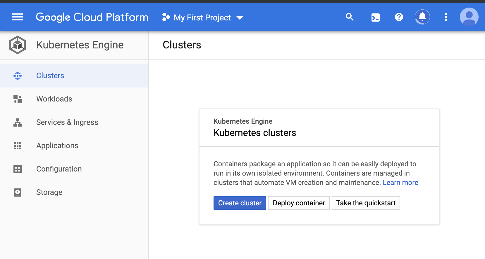
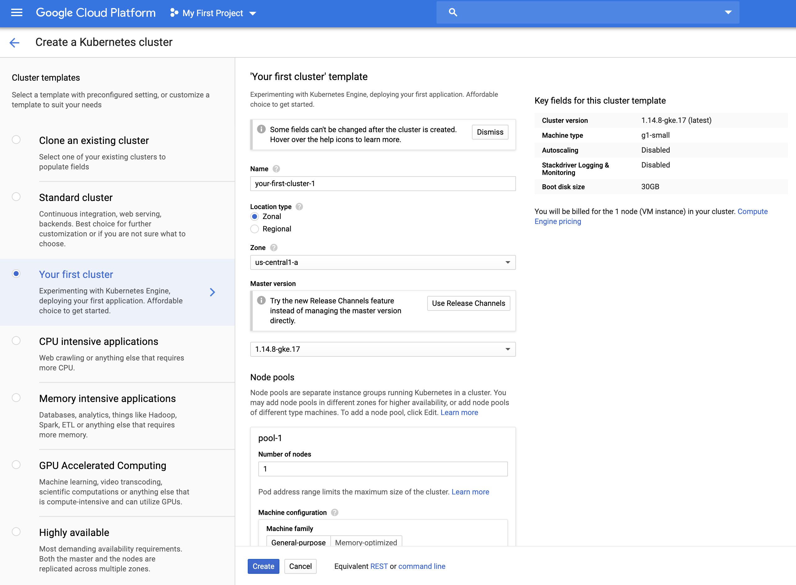
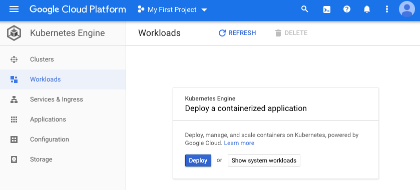
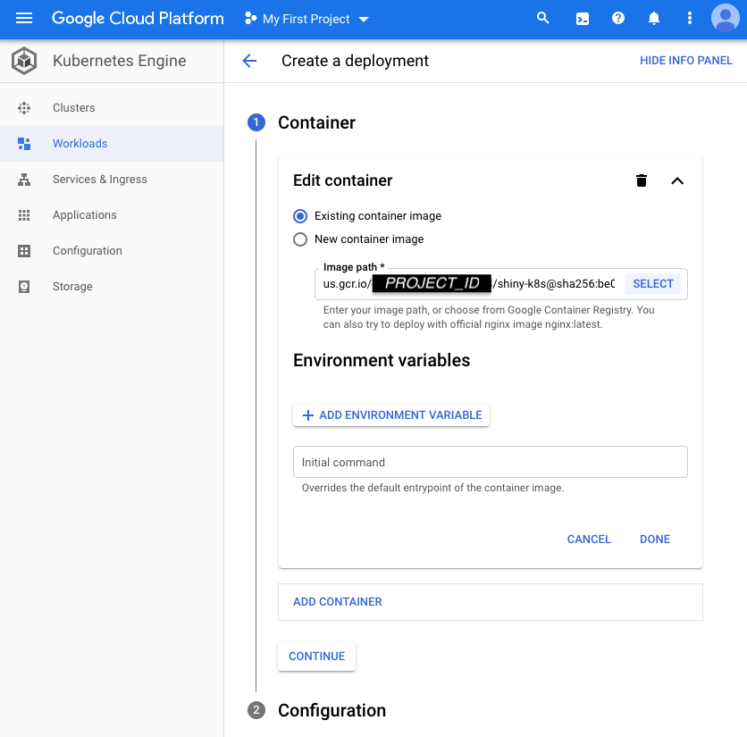
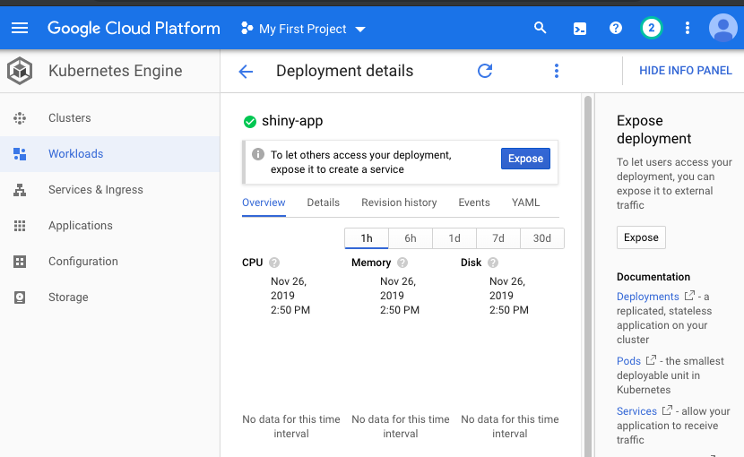
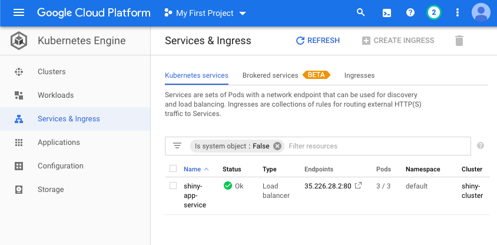
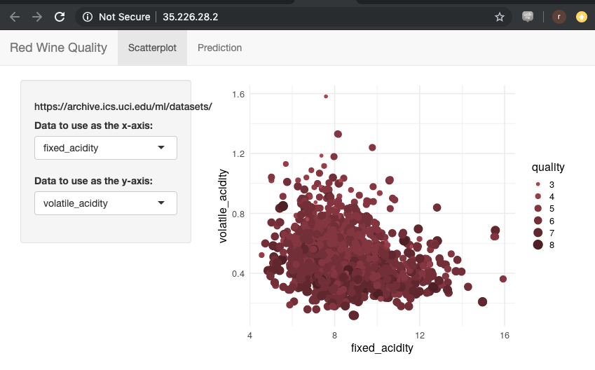

Shiny App on Kubernetes - Google Cloud Deploy
================

## How to deploy your shiny app to Kubernetes

This guide assumes you have a Shiny app written in R. I have an example
one called `wine-explorer` here for reference.

### Dockerize Shiny app

Getting a Shiny app to run in a Docker container is really easy thanks
to the [`rocker`](https://www.rocker-project.org/images/) project,
specifically the `shiny` image. That image comes with R, Shiny Server,
shiny, rmarkdown, as well the system libraries for rendering graphics.

The first step is to make your own docker image starting with
`rocker/shiny` image. To do this, create a `Dockerfile` and add the
first line `FROM rocker/shiny`. That’s all you need to do to leverage
all the work from the rocker team\! This is because docker images are
stackable, which means you can build them in layers.

The next piece is to add all the custom options you want. I’m just going
to list what I did which are step-by-step instructions for docker:

Remove all the example apps that come with Shiny Server

    RUN rm -rf /srv/shiny-server/*

Update the underlying Linux OS (based on Debian) and install system
level packages

    RUN apt-get update && apt-get install -y \
        libssl-dev \
        libxml2-dev

Install the R packages I want to use

    RUN install2.r --error \
        ggplot2 \
        data.table

Copy the code for my Shiny app locally to the container’s Shiny Server
directory

    COPY wine-explorer /srv/shiny-server

Add an entry point for what to run when the container starts by default
– start Shiny Server

    CMD ["/usr/bin/shiny-server.sh"]

These instructions are pretty similar to what you might enter in the
command line when you are installing a Shiny app to Shiny Server
directly on a Linux sever, with the noticable difference that they all
start with docker specific keywords:

  - `FROM`
  - `RUN`
  - `COPY`
  - `CMD`

There are a lot of other docker keywords and options you might want to
[explore here](https://docs.docker.com/engine/reference/builder/).

With the `Dockerfile` created, you next need to build it. When you do
this, you need to name the image you are building. I named my docker
image `shiny-k8s`.

``` bash
docker build -t shiny-k8s --file Dockerfile
```

The `--file Dockerfile` is explicit, but you docker knows to look for a
file with that name so you could replace that part with just `.`

Now you can run the built docker image to make sure your app works

``` bash
docker run --rm -p 3838:3838 shiny-k8s
```

This starts up a virtual machine runing the Linux version your docker
image is based on (Rocker uses Debian) and all the other instructions
you gave it in the docker image you started `FROM` plus what you put in
your `Dockerfile`. The additional options here `--rm` tells docker to
remove the container when you stop running it, and `-p 3838:3838`
forwards port 3838 on the container to your local machine so that you
can open `localhost:3838` in your browser and check that the Shiny app
worked like you expected.

### Getting to Kubernetes

First off, let’s establish some acronymns:

  - `k8s`: Kubernetes
  - `GCP`: Google Cloud Platform
  - `GCR`: Google Container Registry
  - `CLI`: Command Line Interface

With that out of the way, there are multiple ways you can get started
depending on your preference for a visual interface or a CLI.

#### Step 1: Create a cluster

If you don’t have a cluster ready, you’ll need to create one. GCP
provides a service just for running k8s clusters making this process
super easy.

Once you setup a GCP account and create a project, you’ll want to
[install the `gcloud` CLI](https://cloud.google.com/sdk/gcloud/) and add
your project ID as an environment variable (for copy/pasta goodness)

    export PROJECT_ID=random-words-123456

There are a lot of options for your cluster, most of which come with
good defaults, such as:

  - `region`
  - `machine-type`
  - `num-nodes`
  - `max-pods-per-node`
  - `enable-autoscaling`

Creating the cluster using the
CLI

``` bash
gcloud container clusters create shiny-cluster --zone us-central1-a  # append any other options
```

or using the GCP web console





#### Step 2: Push Docker Image to a Cloud Registry

Once you have a cluster to deploy to, you’ll need to get your local
docker image up to GCR so your k8s cluster can pull from it. You could
also use a public registry like Docker Hub if you wanted.

``` bash
docker tag shiny-k8s us.gcr.io/$PROJECT_ID/shiny-k8s:0.1
```

``` bash
docker push us.gcr.io/$PROJECT_ID/shiny-k8s:0.1
```

You should now be able to see your image lissted in GCR

using the CLI

``` bash
gcloud container images list-tags us.gcr.io/$PROJECT_ID/shiny-k8s
# DIGEST        TAGS  TIMESTAMP
# be0491b3c0ee  0.1   2019-11-25T23:54:21
```

or the web console


#### Step 4: Deploy App

We’ll need to configure our environment to use the k8s cluster we made
on GCP so we can use the `kubectl` CLI from here on out.

``` bash
gcloud container clusters get-credentials shiny-cluster \
  --zone us-central1-a --project $PROJECT_ID
```

First off, we tell our cluster to create a deployment for our app based
on the container we uploaded to GCR and give it a name (I use
`shiny-app`)

``` bash
kubectl create deployment shiny-app \
  --image us.gcr.io/$PROJECT_ID/shiny-k8s:0.1
```

or using the web console





Next we want to expose our app to the internet

``` bash
kubectl expose deployment shiny-app \
  --type=LoadBalancer \
  --port 80 --target-port 3838
```

or using the web console




That’s it\! We should now have a shiny app running on k8s that we can
get to from a public IP address.

You can get the public IP address by running

``` bash
kubectl get service
```

or from the web console



#### Done\!



### Final Thoughts

There are some additional options you might want to do to make your
shiny app more reliable.

Replicate the app so it can handle more users

``` bash
kubectl scale deployment shiny-app --replicas 3
```

If you need to update your app, rebuild your docker image and push to
GCR with an updated tag

``` bash
docker tag shiny-k8s us.gcr.io/$PROJECT_ID/shiny-k8s:0.2
docker push us.gcr.io/$PROJECT_ID/shiny-k8s:0.2
```

Then you can set your k8s deployment to use the new docker image

``` bash
kubectl set image deployment/shiny-app \
  shiny-app=us.gcr.io/$PROJECT_ID/shiny-k8s:0.2
```

Instead of manually stepping through these steps, you may want to using
a config file. This has several benefits, such as

  - easier version control
  - more flexability and easier to make complex deployments

k8s supports both `JSON` and `YAML` formats for this. If you already
followed along this tutorial, you can see the GCP actually allows you to
see the exact YAML created for the k8s cluster and the deployment (shiny
app) with load balancer (publically expose with port forward).

## More Resources

[GCP Google Kubernetes
Engine](https://cloud.google.com/kubernetes-engine/)

[GCP Kubernetes
tutorials](https://cloud.google.com/kubernetes-engine/docs/tutorials/)

[Make your app use a static IP address and register a
DNS](https://cloud.google.com/kubernetes-engine/docs/tutorials/configuring-domain-name-static-ip)

If you don’t really want a whole k8s cluster, but you still want this
easy deploy and scaling experience, you should check out [GCP Cloud
Run](https://cloud.google.com/run/)
